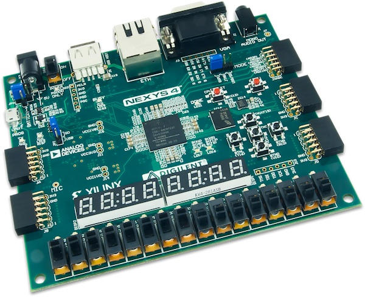

# FPGACombinationLock
Four digits combination lock with alarm leds/7SEG. Password can be entered by switchers and buttons. All stuff are available on Xilinx Nexys 4. 

## System
Project is written in Aldec Active-HDL Student Edition and works on Xilinx Nexys 4.

### Motivation
This project is made for Digital Systems Design subject during studies on fifth term on Electronics on University of Science and Technology in Cracow.